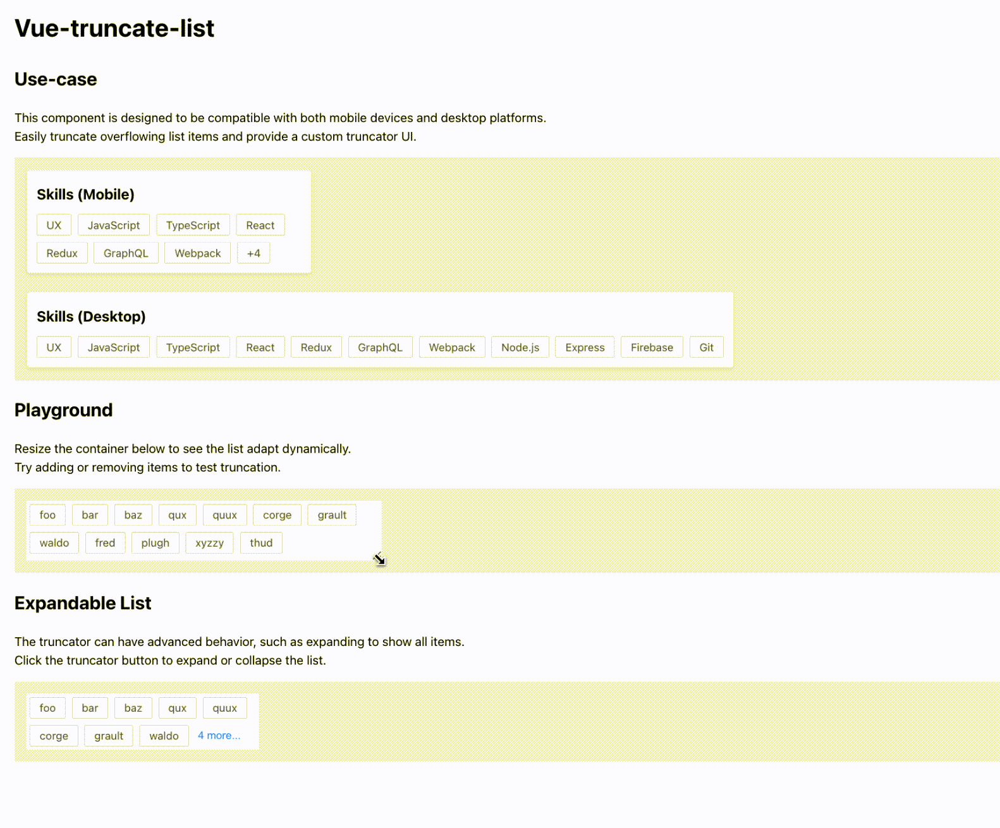

# vue-truncate-list

A flexible Vue 2 & Vue 3 component for truncating lists with custom truncator rendering. Designed for both mobile and desktop platforms.

[](https://www.npmjs.com/package/@twheeljs/vue-truncate-list)
[](./LICENSE)
[](https://bundlephobia.com/package/@twheeljs/vue-truncate-list)
[](https://www.npmjs.com/package/@twheeljs/vue-truncate-list)

## Features

- **Automatic truncation**: Dynamically hides overflowing list items.
- **Custom truncator**: Render your own truncator UI (e.g., "+3 more", "Show all").
- **Responsive**: Works on both mobile and desktop layouts.
- **Expandable**: Supports expandable/collapsible lists.

## Demo

See [src/App.vue](src/App.vue) for usage examples.


## Installation

```sh
npm install @twheeljs/vue-truncate-list
# or
yarn add @twheeljs/vue-truncate-list
```

## Usage

### Basic Example

```vue
<template>
  <TruncateList
    :renderTruncator="({ hiddenItemsCount }) => h('div', { class: 'listItem' }, `+${hiddenItemsCount}`)"
  >
    <div class="listItem">Item 1</div>
    <div class="listItem">Item 2</div>
    <div class="listItem">Item 3</div>
    <!-- ... -->
  </TruncateList>
</template>

<script>
import { h } from 'vue'
import TruncateList from './components/TruncateList'

export default {
  components: {
    TruncateList
  }
}
</script>
```

### Expandable List Example

```vue
<template>
  <TruncateList 
    :class="['list', 'expandable', expanded ? 'expanded' : '']" 
    :alwaysShowTruncator="true"
    :renderTruncator="({ hiddenItemsCount, truncate }) => {
      if (hiddenItemsCount > 0) {
        return h(
          'button',
          {
            class: 'expandButton',
            onClick: () => {
              handleExpand();
              // Manually call truncate() in nextTick to ensure layout is recalculated
              nextTick(() => {
                truncate();
              })
            }
          },
          `${hiddenItemsCount} more...`
        );
      } else {
        return h(
          'button',
          {
            class: 'expandButton',
            onClick: handleCollapse
          },
          'hide'
        );
      }
    }"
  >
    <div class="listItem">foo</div>
    <!-- ... -->
    <div class="listItem">thud</div>
  </TruncateList>
</template>

<script>
import { h, ref, nextTick } from 'vue'
import TruncateList from './components/TruncateList'

export default {
  components: {
    TruncateList
  },
  setup() {
    const expanded = ref(false);
    const handleExpand = () => {
      expanded.value = true;
    }
    const handleCollapse = () => {
      expanded.value = false;
    }

    return {
      expanded,
      handleExpand,
      handleCollapse
    }
  }
}
</script>
```

Note: In this case, setting the 'expanded' class sets max-height to none, but the container's height does not update immediately. This means ResizeObserver will not trigger.
Therefore, we need to manually call `truncate()` in nextTick to ensure the layout is recalculated.

### Props

| Name                  | Type                                                                                                      | Default | Description                                                                                                                                      |
|-----------------------|-----------------------------------------------------------------------------------------------------------|---------|--------------------------------------------------------------------------------------------------------------------------------------------------|
| `renderTruncator`     | `({ hiddenItemsCount, truncate }: { hiddenItemsCount: number, truncate: () => void }) => string \| VNode` | -       | Function to render the truncator UI. Receives `hiddenItemsCount` (number of hidden items) and `truncate` (call to recalculate layout if needed). |
| `alwaysShowTruncator` | `boolean`                                                                                                 | `false` | Whether to always show the truncator, even when no items are hidden.                                                                             |


## Contributing

Contributions are welcome! Please open an issue or submit a pull request for any improvements or bug fixes.

### Getting started
```sh
npm install

npm run dev
```

## Credits

Thanks to
- [maladr0it/react-truncate-list](https://github.com/maladr0it/react-truncate-list): for the original design and inspiration

## License

[MIT](./LICENSE)